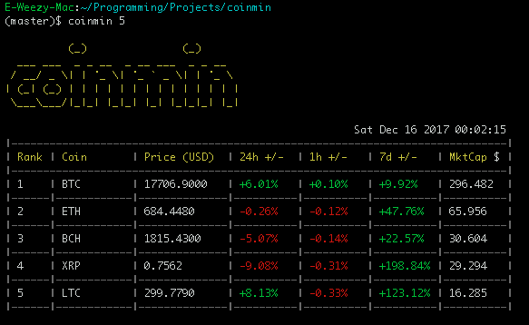

# Coinmin

*A "One-Liner" Reimplementation of [Coinmon](https://github.com/bichenkk/coinmon.git) in Bash*

### Why?

A few days ago I was stumbled across coinmon, a CLI tool for checking cryptoprices. I thought it was pretty neat, but as I looked into the code I was surprised by how many [dependencies](http://npm.anvaka.com/#/view/2d/coinmon) it had! I didnt really want to install all those packages into an nodeenv, just to read some numbers from the internet, but I did think it looked v cool.

Anyway I figured maybe some people (oddballs like me), might appreciate a pure bash CLI implementation, without 20 odd npm dependencies, just curl and curses. *(lol jk obviously I didn't use curses.)*

Despite the fact I have an aversion to crazy npm dependencies, I have to say, big love to coinmon. Their design is brilliant and I thought it was a really cool idea, and well executed.  If you're browsing this, you should check it out cos I think they're working on new features!

### Pics or It Didnt Happen


### Install

```bash
# in your .bashrc
source PATH/TO/coinmin.sh
```
